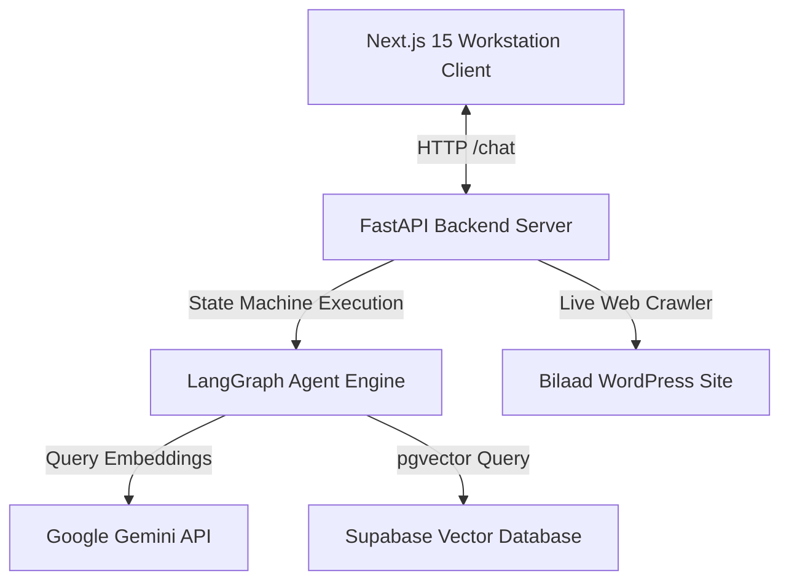

# Bilaad AI: Luxury Real Estate RAG Portfolio Assistant

Bilaad AI is an enterprise-grade, investor-focused real estate RAG (Retrieval-Augmented Generation) prototype. It connects high-net-worth investors with the sustainable, destination-themed property portfolio of **Bilaad Realty** in Abuja, Nigeria. 

The application features a modern dual-theme workstation dashboard built with **Next.js 15 (App Router, Turbopack)** and a resilient asynchronous search agent built with **FastAPI**, **LangGraph**, and **Supabase (pgvector)**.

---

## 🏗️ Architecture Overview

The project is structured as a monorepo separated into two decoupled components:



### 1. Backend Workstation (`/backend`)
* **FastAPI Server**: Lightweight API controller exposing `/chat` and `/ingest` endpoints.
* **LangGraph Agent Engine**: Formulates retrieval-augmented system responses by checking user intents and dynamically routing logic between semantic searches and structural component renders.
* **Supabase pgvector Adaptor**: Implements low-latency vector similarity searching using Google's `gemini-embedding-001` model (dimension 768).
* **Robust Ingestion Pipeline**: Live WordPress site scraping merged with high-fidelity, hand-verified property specifications. Features batch-10 upload sizing and 20-second pauses to guarantee safety under strict Gemini Free Tier rate limits (100 RPM).

### 2. Frontend Workstation (`/frontend`)
* **Next.js 15 (App Router, TS)**: Optimized production client built for performance and speed.
* **Luxury CSS Workspace Layout**: Ivory-Alabaster (light) and Obsidian-Charcoal (dark) color systems utilizing a custom glassmorphism style sheet.
* **Split-Pane Workstation**: Multi-column desktop layout that renders the interactive chat interface on the left and a persistent, detailed Property Showcase card on the right.

---

## 📁 Repository Directory Structure

```text
Bilaad-AI/
├── backend/
│   ├── app/
│   │   ├── config.py         # Configuration validation & environment loaders
│   │   ├── main.py           # FastAPI endpoints & CORS config
│   │   ├── graph.py          # LangGraph state machine, intents, LLM validations
│   │   ├── scraper.py        # 14-property live crawler & rate-limited ingestion
│   │   ├── vector_store.py   # Embedding setup, Supabase client, Postgrest patches
│   │   └── test_agent.py     # System routing & intent verification tests
│   └── requirements.txt      # Python package dependencies
├── frontend/
│   ├── src/
│   │   ├── app/              # Next.js App Router root layout & landing page
│   │   └── components/       # Custom React UI components (PropertyCard, ChatInterface)
│   ├── package.json          # Node package dependencies
│   └── tsconfig.json         # TypeScript project configurations
└── .gitignore                # Global version control ignores (locks, environment files)
```

---

## 🗄️ Database & Schema Specifications

### 1. Database Schema
Ensure your Supabase project contains the `documents` table configured with `pgvector` extension:

```sql
-- Enable the pgvector extension to work with embeddings
create extension if not exists vector;

-- Create the documents table
create table documents (
  id bigint primary key generated always as identity,
  content text,
  metadata jsonb,
  embedding vector(768) -- Matches models/gemini-embedding-001 output
);
```

### 2. Similarity Search Function (`match_documents`)
Because newer versions of the Supabase Postgrest SDK enforce named RPC parameters, verify your SQL search function is declared exactly as follows:

```sql
create or replace function match_documents (
  query_embedding vector(768),
  match_threshold float default 0.2,
  match_count int default 5
)
returns table (
  id bigint,
  content text,
  metadata jsonb,
  similarity float
)
language plpgsql
as $$
begin
  return query
  select
    documents.id,
    documents.content,
    documents.metadata,
    1 - (documents.embedding <=> query_embedding) as similarity
  from documents
  where 1 - (documents.embedding <=> query_embedding) > match_threshold
  order by documents.embedding <=> query_embedding asc
  limit match_count;
end;
$$;
```
```

---

## 🛠️ Local Running Guide

### Prerequisites
* Python 3.10+ installed
* Node.js 18+ installed

### 1. Backend Setup
1. Open a terminal and navigate to the backend folder:
   ```bash
   cd backend
   ```
2. Install python dependencies:
   ```bash
   pip install -r requirements.txt
   ```
3. Create a `.env` file under `backend/` and configure your API credentials:
   ```env
   GEMINI_API_KEY=your_gemini_api_key_here
   SUPABASE_URL=https://your-project-id.supabase.co
   SUPABASE_KEY=your_supabase_anon_or_service_key
   ```
4. Start the FastAPI development server:
   ```bash
   python -m uvicorn app.main:app --host 0.0.0.0 --port 8000 --reload
   ```

### 2. Frontend Setup
1. Open a new terminal and navigate to the frontend folder:
   ```bash
   cd frontend
   ```
2. Install npm dependencies:
   ```bash
   npm install
   ```
3. Create a `.env.local` file under `frontend/` to point to the local backend:
   ```env
   NEXT_PUBLIC_API_URL=http://localhost:8000
   ```
4. Start the Next.js development server:
   ```bash
   npm run dev
   ```

---

## 🚀 MVP Production Deployment Guide

### 📍 Step 1: Deploy Backend (Railway)
1. Link your GitHub repository to [Railway.app](https://railway.app).
2. Configure your service:
   * **Root Directory**: `backend`
   * **Start Command**: `python -m uvicorn backend.app.main:app --host 0.0.0.0 --port $PORT`
3. In the **Variables** settings, supply:
   * `GEMINI_API_KEY`, `SUPABASE_URL`, `SUPABASE_KEY`

### 📍 Step 2: Deploy Frontend (Vercel)
1. Link your GitHub repository to [Vercel](https://vercel.com).
2. Configure the deployment:
   * **Root Directory**: `frontend`
   * **Environment Variables**:
     * `NEXT_PUBLIC_API_URL` pointing to the public URL of your deployed Railway app (e.g., `https://bilaad-backend-production.up.railway.app`).

### 📍 Step 3: Trigger Initial Ingestion
Once the backend is live on Railway, call the `/ingest` REST endpoint once to populate the Supabase database with all 14 property specifications:
```powershell
Invoke-WebRequest -Uri https://your-railway-app.up.railway.app/ingest -Method POST
```

---

## 🧪 System Verification

To run intent routing, agent schemas, and Pydantic response contract validation tests, execute:
```bash
python backend/app/test_agent.py
```
Expected output:
```text
[TESTS] Starting LangGraph Routing & Intent Tests...
[RUN] Maldives Intent Routing -> [SUCCESS]
[RUN] Bali Island Intent Routing -> [SUCCESS]
[RUN] General Query (RAG Routing) -> [SUCCESS]
[SUCCESS] All LangGraph routing tests passed successfully!
```
